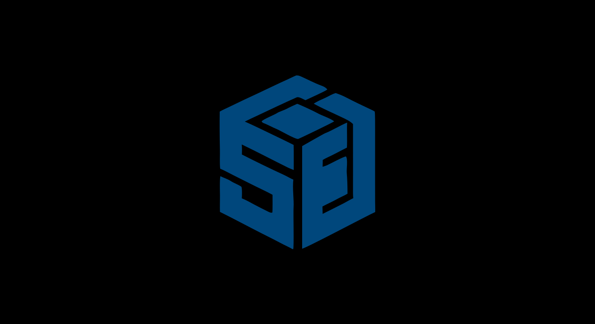

<p align="center">
  
</p>

<p align="center">
  <strong>A lightweight, secure, and server-first operating system built on the Linux kernel.</strong>
</p>

<p align="center">
  <a href="#-features">Features</a> •
  <a href="#-architecture">Architecture</a> •
  <a href="#-roadmap">Roadmap</a> •
  <a href="#-development">Development</a> •
  <a href="#-contributing">Contributing</a>
</p>

---

# 🦀 Senbit

**Senbit** is a general-purpose **server operating system based on the Linux kernel**, designed around four core principles:

> ⚡ Performance · 🪶 Lightweight · 🧱 Stability · 🚀 Deployment

Senbit aims to provide a clean, efficient, and secure foundation for servers while preserving the compatibility and ecosystem of Linux.

The goal is not to reinvent the Linux ecosystem.

Instead, Senbit builds modern infrastructure around the Linux kernel to make servers easier to deploy, maintain, update, monitor, secure, and recover.

---

## 🚧 Project Status

> **Senbit is currently in early development.**

The project is currently establishing its core architecture, build system, development workflow, and initial operating-system foundation.

The first milestone is focused on creating a minimal Senbit system capable of booting in a virtual machine.

Features described in the roadmap are planned capabilities and should not be considered implemented unless explicitly documented.

---

# 🎯 Vision

Modern infrastructure can involve anything from a single self-hosted server to thousands of machines.

Senbit is designed with both use cases in mind.

The long-term goal is to provide a server operating system that is:

- ⚡ Fast and lightweight
- 🧱 Stable
- 🛡️ Secure by default
- 📦 Compatible with existing Linux software
- 🚀 Easy to deploy
- 🔄 Easy to update
- ↩️ Easy to recover and roll back
- 🖥️ Suitable for physical servers and virtual machines
- 🌐 Suitable for large-scale deployments

Senbit is intentionally **general-purpose**.

The operating system does not target a single type of server.

A company should be able to use the same Senbit foundation for web servers, databases, container hosts, storage systems, game servers, internal infrastructure, or other Linux-compatible workloads.

---

# ✨ Features

The following capabilities are part of the Senbit design and development roadmap.

### 🪶 Lightweight

A minimal base installation with no unnecessary server applications or graphical desktop environment installed by default.

### ⚡ Performance

A lightweight userspace and efficient system infrastructure designed for server workloads.

### 🧱 Stability

Reliable updates, controlled system changes, recovery mechanisms, and a conservative approach to modifying the Linux foundation.

### 🛡️ Security

Secure defaults, firewall integration, auditing, monitoring, integrity verification, and minimal default software exposure.

### 📦 Linux compatibility

Senbit is designed to use the existing Debian package ecosystem and APT instead of creating an entirely separate package ecosystem.

### 🚀 Deployment

Configuration-based installations and automation designed for everything from individual machines to large server fleets.

### 🔄 Reliable updates

Online and offline system updates, including updates performed using installation media such as a USB drive.

### ↩️ Snapshots & rollback

Configurable snapshots and rollback mechanisms designed to make system changes recoverable.

### 🖥️ Server-first

No graphical desktop environment is included.

Senbit is designed to be administered through terminals, SSH, configuration, automation, and system-management tools.

---

# 🏗️ Architecture

Senbit is built **around the Linux kernel**, rather than attempting to replace it.

```text
┌────────────────────────────────────────────────┐
│              Server Applications               │
│                                                │
│ Docker · Podman · nginx · databases · ...     │
├────────────────────────────────────────────────┤
│                 Senbit Userspace               │
│                                                │
│ Rust services · system tools · management     │
├────────────────────────────────────────────────┤
│            Senbit System Infrastructure        │
│                                                │
│ Updates · snapshots · security · monitoring   │
│ deployment · configuration · compatibility   │
├────────────────────────────────────────────────┤
│                  Linux Kernel                   │
│                                                │
│ Processes · memory · networking · drivers     │
│ filesystems · security · virtualization       │
└────────────────────────────────────────────────┘
````

The Linux kernel continues to provide the low-level operating-system functionality it already handles well.

Senbit focuses on the layers built around it.

---

# 🐧 Linux Kernel

Senbit uses the upstream Linux kernel as its foundation.

This provides access to the mature Linux ecosystem, including:

* CPU scheduling
* Memory management
* Networking
* Storage
* Filesystems
* Hardware drivers
* Security primitives
* Virtualization
* Process management
* System calls
* Multiple CPU architectures

Senbit does not aim to rewrite functionality that Linux already provides reliably.

Instead, the project maintains its own kernel configuration and may introduce carefully scoped patches when there is a concrete reason to do so.

---

# 🦀 Rust-first Userspace

Senbit's own system components will primarily be written in **Rust**.

The Linux kernel itself remains primarily written in C, while Rust can be used where appropriate within the kernel's supported infrastructure.

Rust is an important architectural choice for Senbit because memory safety is particularly valuable for system software and privileged components.

The objective is not to use Rust everywhere.

The objective is to use appropriate technologies for each layer.

```text
                    Linux Kernel
                         │
                  C + supported Rust
                         │
                         ▼
                 ┌───────────────┐
                 │    Senbit     │
                 │   Userspace   │
                 └───────┬───────┘
                         │
             ┌───────────┼───────────┐
             ▼           ▼           ▼
           Rust        Rust        Linux
         Services      Tools       Software
```

---

# 📦 Linux Software Ecosystem

Senbit intentionally does not create a completely new software ecosystem.

The project intends to use **Debian packages and APT**.

This allows Senbit to benefit from the existing Linux ecosystem and the large amount of software already packaged for Debian-based systems.

Administrators can therefore install the software appropriate for their workload instead of being forced into a Senbit-specific application ecosystem.

Examples include:

* 🐳 Docker
* 📦 Podman
* ☸️ Kubernetes
* 🌐 nginx
* 🔐 OpenSSH
* 🗄️ PostgreSQL
* 🐬 MariaDB
* and many other Linux-compatible applications

These applications are **not installed by default**.

---

# 🚀 Deployment

Deployment is one of Senbit's primary design goals.

A Senbit installation should eventually be configurable before deployment through configuration files.

For example:

```yaml
hostname: server-001

updates:
  automatic: true

snapshots:
  enabled: true
  retention: 7d

packages:
  - openssh-server
  - docker.io
  - nginx
```

The exact configuration format is not finalized yet.

The long-term goal is to allow administrators to define the desired state of a machine before deployment.

This can make the same configuration reusable across multiple machines.

Potential use cases include:

* 🏢 Enterprise infrastructure
* ☁️ Cloud infrastructure
* 🖥️ Server fleets
* 🏭 Large deployments
* 🧪 Testing environments
* 🏠 Self-hosting

---

# 🔄 Updates

Senbit is designed around reliable system updates.

Updates should support both connected and disconnected environments.

## 🌐 Online updates

Systems can retrieve updates from their configured sources through the network.

## 💾 Offline updates

Systems can also be updated without an Internet connection.

For example, an administrator could provide a new Senbit image or update media through a USB drive.

This is important for servers operating in isolated or restricted environments.

## 🧩 Partial updates

The update infrastructure is intended to replace only the components that actually changed whenever possible.

A kernel update should not unnecessarily require unrelated system components to be replaced.

---

# ↩️ Snapshots & Rollback

Senbit is designed around the idea that important system changes should be recoverable.

Snapshots can be enabled through configuration.

A simplified update flow could look like:

```text
Current System
      │
      ▼
   Snapshot
      │
      ▼
    Update
      │
      ├───────────────┐
      │               │
      ▼               ▼
   ✅ Success       ❌ Failure
      │               │
      ▼               ▼
 Continue          Rollback
```

Administrators should be able to configure:

* Whether snapshots are enabled.
* How long snapshots are retained.
* Where snapshots are stored.
* Which storage device is used.
* Which operations create snapshots.

The goal is to make system updates safer without forcing every deployment to use the same storage strategy.

---

# 🛡️ Security

Security is a core Senbit objective.

A fresh installation should contain only what is necessary for the operating system itself.

Server applications should not be installed unnecessarily.

This reduces the amount of software exposed by default and gives administrators control over what runs on their systems.

Planned security infrastructure includes:

* 🔥 Firewall management
* 🔎 Security auditing
* 📊 System monitoring
* 🔏 File integrity verification
* 🧩 Per-application file tracking
* 🔐 Permission management
* 🔄 Update verification

---

# 🔏 File Integrity

Senbit is intended to provide mechanisms for tracking files associated with installed software.

One possible implementation is to associate files with cryptographic fingerprints.

For example:

```text
Application
├── Binary
│   └── SHA-256
├── Libraries
│   └── SHA-256
└── Configuration
    └── Integrity information
```

This can help detect unexpected modifications and provide additional information to auditing and monitoring systems.

The exact implementation and storage model are still under development.

---

# 📊 Monitoring & Auditing

Senbit is intended to provide administrators with useful information about the state of their systems.

Planned monitoring and auditing capabilities include:

* System activity
* Resource usage
* Service status
* Security events
* File integrity
* Software changes
* Package updates
* Configuration changes
* Administrative actions

The goal is to make the basic state of a server visible without requiring a large collection of unrelated tools for fundamental system information.

---

# 🖥️ Server-Only

Senbit is a **server operating system**.

A graphical desktop environment will not be included.

The system is intended to be administered through:

* 💻 Terminal
* 🔐 SSH
* ⚙️ Configuration files
* 🤖 Automation
* 🛠️ System-management tools

This keeps the base installation focused on server workloads rather than desktop use.

---

# 🏎️ Performance

Senbit approaches performance primarily through simplicity.

The goal is not to blindly optimize every component.

Instead, Senbit aims to reduce unnecessary software, services, overhead, and duplication while keeping the mature Linux kernel underneath.

```text
Minimal Base System
        +
Efficient Userspace
        +
Linux Hardware Support
        +
Efficient Updates
        +
Deployment Automation
        │
        ▼
Efficient Server Platform
```

Performance claims will eventually be backed by reproducible benchmarks.

---

# 🧩 Multi-Architecture

Senbit is designed to support multiple architectures suitable for server workloads.

The initial development priority is:

```text
x86_64
```

Additional architectures are intended to be supported when they provide practical value for server deployments.

The project should therefore avoid unnecessary architectural assumptions that would make future portability difficult.

---

# 🛠️ Development

Senbit is being developed around a dedicated build and development environment.

The project will provide scripts designed to simplify building, cleaning, and setting up the development environment.

## Install development dependencies

```bash
./install.sh
```

Installs the tools required to build Senbit.

## Build

```bash
./build.sh
```

Builds Senbit.

The build system is intended to support rebuilding only selected components when possible.

## Clean

```bash
./clean.sh
```

Cleans generated build artifacts.

Different cleaning levels and component-specific cleaning will be supported.

## Make

A `Makefile` will also provide a convenient interface for common development operations.

The exact commands and available options may evolve during early development.

---

# 🧪 First Milestone

The first milestone focuses on creating the smallest useful Senbit system.

```text
              QEMU
                │
                ▼
         Linux Kernel
                │
                ▼
         Senbit RootFS
                │
                ▼
           Senbit Init
                │
                ▼
              Shell
```

### Initial targets

* [ ] Linux kernel build
* [ ] Senbit kernel configuration
* [ ] Minimal root filesystem
* [ ] Senbit init
* [ ] Initial userspace
* [ ] QEMU boot
* [ ] Console access
* [ ] Clean shutdown

Once this foundation works, development can progressively move toward networking, storage, users, SSH, package integration, updates, snapshots, security, monitoring, deployment, and recovery.

---

# 🗺️ Roadmap

The roadmap focuses on capabilities rather than fixed release dates.

## Phase 0 — Foundation 🏗️

* [ ] Repository structure
* [ ] Build system
* [ ] Development environment installer
* [ ] Linux kernel integration
* [ ] Senbit kernel configuration
* [ ] Minimal root filesystem
* [ ] Senbit init
* [ ] QEMU boot
* [ ] Console
* [ ] Shutdown

## Phase 1 — Basic Server 🖥️

* [ ] Networking
* [ ] Network configuration
* [ ] Storage initialization
* [ ] Filesystem support
* [ ] Users and groups
* [ ] Basic system administration
* [ ] SSH
* [ ] Service management

## Phase 2 — Package Ecosystem 📦

* [ ] Debian package compatibility
* [ ] APT integration
* [ ] Package installation
* [ ] Package removal
* [ ] Package updates
* [ ] Automatic update configuration

## Phase 3 — System Updates 🔄

* [ ] System update infrastructure
* [ ] Kernel updates
* [ ] Component-level updates
* [ ] Offline updates
* [ ] USB / installation-media updates
* [ ] Update verification
* [ ] Recovery mechanisms

## Phase 4 — Snapshots & Recovery ↩️

* [ ] Automatic snapshots
* [ ] Snapshot retention
* [ ] Configurable snapshot storage
* [ ] Rollback
* [ ] Failed-update recovery
* [ ] Boot recovery

## Phase 5 — Security & Monitoring 🛡️

* [ ] Firewall integration
* [ ] Security auditing
* [ ] System monitoring
* [ ] File integrity tracking
* [ ] Application-level file association
* [ ] Integrity verification
* [ ] Security event management

## Phase 6 — Deployment 🚀

* [ ] Configuration-based installation
* [ ] Automated system configuration
* [ ] Automated package installation
* [ ] Reproducible deployment
* [ ] Server fleet deployment
* [ ] Remote administration improvements

## Phase 7 — Multi-Architecture 🌍

* [ ] x86_64
* [ ] ARM64
* [ ] Additional server architectures
* [ ] Architecture-specific optimizations

---

# 🔭 Long-Term Vision

Senbit's long-term objective is to provide more than a minimal Linux distribution.

The goal is to create a **server operating platform** where the complete lifecycle of a machine can be managed predictably:

```text
          Deploy
            │
            ▼
        Configure
            │
            ▼
           Run
            │
            ▼
         Monitor
            │
            ▼
          Update
            │
            ▼
          Verify
            │
            ▼
         Recover
            │
            ▼
       Deploy Again
```

Senbit should make these operations:

* Predictable
* Automatable
* Observable
* Recoverable
* Suitable for both individual servers and large infrastructures

The project will continue to build around the Linux ecosystem instead of replacing it.

---

# 🤝 Contributing

Senbit is built in the open.

Contributions are welcome, including:

* 💻 Code
* 🐧 Linux kernel work
* 🦀 Rust development
* 🧪 Testing
* 📚 Documentation
* 🐛 Bug reports
* 💡 Ideas
* 🔐 Security research
* 🏗️ Architecture discussions

Before contributing, please read:

👉 [`CONTRIBUTING.md`](CONTRIBUTING.md)

For security vulnerabilities:

👉 [`SECURITY.md`](SECURITY.md)

For community guidelines:

👉 [`CODE_OF_CONDUCT.md`](CODE_OF_CONDUCT.md)

---

# 💬 Community

GitHub Discussions is the main place for project discussions.

Available categories include:

* 📢 Announcements
* 💡 Ideas & Proposals
* 🛠️ Development
* ❓ Q&A
* 🐛 Help & Troubleshooting
* 💬 General

Technical discussions, architectural proposals, questions, and project ideas are welcome.

---

# 📜 License

Senbit's original code is licensed under the:

**Apache License 2.0**

The Linux kernel and third-party components retain their respective licenses.

Senbit can therefore contain components under different licenses depending on their origin.

See [`LICENSE`](LICENSE) for the license covering Senbit's original code.

---

# ⭐ Support Senbit

If you are interested in the project:

⭐ Star the repository
💬 Join the Discussions
🐛 Report bugs
💡 Propose ideas
🧑‍💻 Contribute code
📚 Improve the documentation

---

<p align="center">

🦀 **Senbit**

<i>Server infrastructure, built around Linux.</i>

</p>
